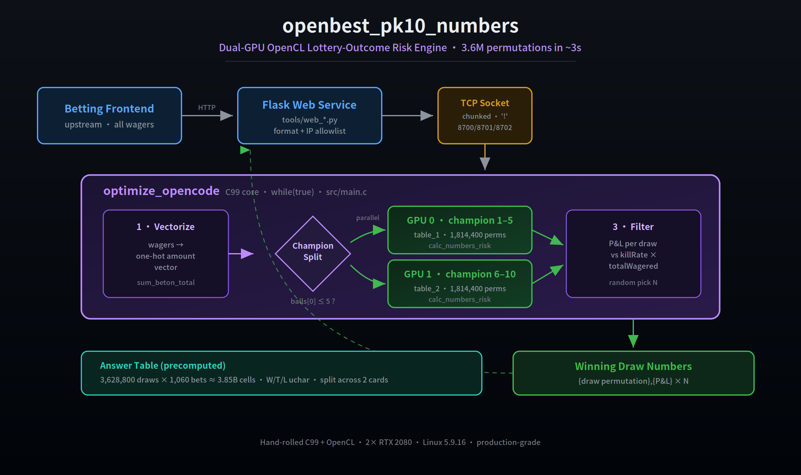

<div align="center">

# 🎲 openbest_pk10_numbers

### ⚡ 雙 GPU 驅動的即時開獎風險運算引擎

**在 3 秒內，用 2× RTX 2080 枚舉 360 萬種開獎排列，算出每一種結果的莊家盈虧。**

<br>

[English](README.md) · 📖 **繁體中文**

<br>


<br>

*一個從零手刻的 GPU 高吞吐風險運算引擎 — 沒有框架、沒有黑盒，只有 C、OpenCL 與兩張顯卡。*

<br>



</div>

---

## 🚀 30 秒看懂

> 給定一整期的**所有投注**，這個引擎會平行枚舉**每一種可能的開獎結果**，
> 即時算出「若開這個號，莊家會賺 / 賠多少」，並依設定的風險門檻挑出最佳結果。

```
   全部注單  ───▶  [ 雙 GPU 平行運算 ]  ───▶  每個開獎號的莊家盈虧  ───▶  依門檻篩選
                    ↑ 38.5 億格勝負表               ↑ 360 萬候選同時算          ↑ 秒級回應
```

**這不是玩具。** 它是一套跑在生產環境、常駐監聽、以 socket 對外服務的 GPU 微服務。

---

## ✨ 專案特色

<table>
<tr>
<td width="50%">

### ⚡ 極致平行
單條 GPU thread 負責一個候選開獎號，
**360 萬種排列同時開算**。2× RTX 2080
在 **~3 秒** 內完成全量枚舉。

</td>
<td width="50%">

### 🧮 Answer-Table 預算法
把「注單 × 開獎號」的勝負結果
**預先算成數十億格的巨型矩陣**，
運算時只做查表 + reduction，零重複計算。

</td>
</tr>
<tr>
<td width="50%">

### 🔀 index 上下半 · 雙卡分治
把 **360 萬種開獎排列**從中間切開，
上半 index / 下半 index 各餵一顆 GPU，
**兩卡同時算、運算時間直接砍半**。

</td>
<td width="50%">

### 🎯 四種玩法通吃
PK10 賽車、時時彩 SSC、11 選 5、快 3 —
**一套引擎、一份 kernel**，
靠 config 切換，不改一行程式碼。

</td>
</tr>
<tr>
<td width="50%">

### 🌐 常駐微服務
`while(true)` 常駐監聽 TCP，
分段收注單、算完即回，
**上游 Flask 一呼即應**。

</td>
<td width="50%">

### 🛠️ 100% 手刻
無 CUDA library、無第三方運算框架。
自寫 OpenCL kernel、自管記憶體、
自建 socket 協定 — **每一行都懂**。

</td>
</tr>
</table>

---

## 📊 效能實測

> 實測環境：2× NVIDIA RTX 2080 · Ubuntu (Linux 5.9.16) · OpenCL · 玩法：**PK10（賽車，計算量最大）**

| 指標 | 數字 |
|------|------|
| 🎰 候選開獎號枚舉 | **3,628,800 種排列 (10!) / 單期** |
| 🧮 勝負對照矩陣 | **≈ 38.5 億 格 (3,628,800 × 1,060 uchar)** |
| ⚡ 全量運算延遲 | **≈ 3 秒** |
| 🔀 GPU 平行度 | **排列 index 上下半切分，2 卡同時算** |
| 🌐 服務型態 | **常駐 socket，秒級回應** |

---

## 🧠 它是怎麼運作的

### ① Answer Table — 把勝負「預先算好」

一張巨大的二維矩陣，把每一種下注在每一種開獎號下的輸贏事先算好：

```
                    DWD1_1   TZF3_1-2-3   B1   ...   SUMB11
   1-2-3-4-5-...       W         L         W    ...    L
   2-1-3-4-5-...       L         L         L    ...    T
      ⋮
   10-9-8-7-6-...      W         W         L    ...    W
```

- **row（列）= 開獎號碼** — 每一種可能開出的號碼
- **column（行）= 玩法 × 下注種類** — 例如 `DWD1_1`(第1名定位膽=1)、`TZF3_1-2-3`(前三名直選)、`B1`(第1名大)、`SUM7`(冠亞和=7)… 由 `createHeader()` 把每種玩法的每個投注選項展開成一欄
- **格子 = 該注在該開獎號下的勝負**

**勝負值：贏 / 輸 / 和局 三態。**

| | 玩家贏 | 和局 | 莊家贏(玩家輸) |
|---|:---:|:---:|:---:|
| 設計語意（產生器輸出） | `+1` | `0` | `-1` |
| 現行儲存格式（省空間、kernel 直讀） | `W` (Win) | `T` (Tie) | `L` (Loss) |

> 絕大多數玩法只有輸/贏（`+1 / -1`）；**和局(`0`)出現在「冠亞和=11」的退水盤** —— `create_opencode_table_split.py` 的 `SUMB11 / SUMS11 / SUMO11 / SUME11` 在冠亞和剛好等於 11 時 `return 0`。
> 儲存格式經歷演進：早期 kernel 直接比對數字 `+1 / 0 / -1`（ASCII `43 / 44 / 45`），後來（commit `85a3d62`「新增支援和局」、`3fbcd52`）改存單 byte 字元 `W / T / L`，讓 GPU 直接比字元、壓縮巨表體積。運算時只需查表 —— **免去每期重算勝負的成本**。

以 PK10（計算量最大的玩法）為例：開獎號 = 10 顆球全排列 **`3,628,800` 種** × 玩法×下注 `1,060` 欄
= 一張 **≈ 38.5 億格** 的 uchar 巨表。要在秒級算完，關鍵在下面的雙卡分治 👇

### ①-B 排列 index 分治 — 上下半切分，雙卡砍半 🔀

> 這是整個專案最關鍵的工程 insight。

360 萬種開獎排列若排隊在單卡上算，時間拉長；PK10 的拆分**依冠軍(第1名)球號**把排列空間切兩半：

```
   完整開獎排列空間 (10! = 3,628,800 種)
   ┌─────────────────────────────────┐
   │  第1名球號 1 ── 10                │
   └─────────────────────────────────┘
            ✂️  依冠軍大小切 (balls[0])
   ┌──────────────────┐   ┌──────────────────┐
   │ 冠軍開 1~5        │   │ 冠軍開 6~10       │
   │ = 1,814,400 排列  │   │ = 1,814,400 排列  │
   │   → GPU 0 / 表1  │   │   → GPU 1 / 表2  │
   └──────────────────┘   └──────────────────┘
          │                        │
          └──────── 同時運算 ───────┘
                        ▼
                 結果合併回傳
```

`create_opencode_table_split.py` 的拆分規則就是 `if balls[0] <= 5 → 表1 else → 表2` —— 冠軍 5 種號 × 剩下 9! 排列，剛好各 181 萬、對半。

**一石二鳥：**
1. **時間** — 兩顆 GPU 各扛一半排列、同時開算同時回收，**運算時間直接砍半**。
2. **空間** — 每半表只需半數 VRAM。同一套切分機制，讓更大的表（如 SSC 拆分後仍達單檔 ~17.7GB）也能**跨卡分攤**跑起原本單卡放不下的規模。

`configs/*.json` 的 `OPENCODE_ANSWER_TABLE_PATH` 就是兩個檔（`_table_1` / `_table_2`），
`USE_GPU_NUM=2` 把兩半分派給兩張卡 —— **PK10 的 360 萬開獎號正是需要拆分的動機來源；SSC 開獎號只有 10 萬，順便一起算、更快回收。**

### ② GPU Kernels — 兩顆核心，火力全開

| Kernel | 職責 |
|--------|------|
| `sum_beton_total_amount` | 把所有注單依下注類型加總（本金 / 本金×賠率）|
| `calc_numbers_risk` | **主引擎**：每條 thread 算一個開獎號 → 遍歷注單查表 → `W` 加賠付、`L` 扣本金、`T` 歸零 → 得到該號的莊家盈虧 |

### ③ 即時篩選 — 依風險門檻挑結果

```c
targetAmount = 總下注額 × 風險門檻(killRate)
方向 = +1 → 篩「盈虧 ≥ 門檻」的開獎號
方向 = -1 → 篩「盈虧 ≤ 門檻」的開獎號
無達標 → 自動退回極值結果
最後亂數挑 N 個回傳
```

---

## 🗺️ 系統架構

```
 ┌──────────────┐   投注資料(HTTP)   ┌────────────────────┐
 │  投注前端 /   │ ─────────────────▶ │  Flask Web 服務      │
 │  上游盤口     │                    │  tools/web_*.py      │
 └──────────────┘                    │  (格式轉換 + 白名單) │
                                     └─────────┬──────────┘
                            TCP socket · 分段傳輸 · 以 '!' 結尾
                            8700=11x5 · 8701=k3 · 8702=ssc
                                               │
                                               ▼
                              ┌────────────────────────────────┐
                              │   ⚡ optimize_opencode (C核心)   │
                              │                                  │
                              │   注單 → one-hot 金額向量         │
                              │   雙 GPU 枚舉開獎號 × 查勝負表    │
                              │   → 每個號的莊家盈虧              │
                              │   → 依門檻篩選 → 回傳             │
                              └────────────────┬─────────────────┘
                                               │
                                               ▼
                                  {開獎號},{盈虧金額} × N
```

---

## ⚙️ 技術棧

| 層 | 技術 |
|----|------|
| 運算核心 | **C99 + OpenCL**（雙 NVIDIA GPU）|
| 記憶體策略 | Answer-table 分片 · `CL_MEM_USE_HOST_PTR` · one-hot 向量化 |
| 對外服務 | 原生 **BSD socket**，自訂分段傳輸協定 |
| 設定管理 | `json-c` 讀取各玩法 config |
| 上游工具鏈 | **Python 3 · Flask · pandas · pyopencl** |
| 依賴管理 | `json-c` · `ocl-icd` · `opencl-headers` |
| 部署環境 | Ubuntu · Linux kernel **5.9.16** · nvidia-driver-455 |

---

## 📂 專案結構

```
.
├── src/                     ⚙️ C 主程式
│   ├── main.c               ← 常駐主迴圈 · OpenCL 排程 · 篩選邏輯
│   ├── network.c            socket 收送
│   ├── loadData.c           載入注單 / 開獎號 / 勝負表
│   ├── argument.c           參數解析 + config 讀取
│   └── logger.c mystring.c utility.c hashmap.c myfile.c dateTime.c
├── header/                  📑 標頭檔（common.h 定義全域參數 / VERSION）
├── kernels/
│   └── kernel_program.cl    🔥 兩個 OpenCL kernel — 運算心臟
├── configs/                 🎛️ 各玩法設定（埠號 / 路徑）
│   ├── ssc_config.json      SSC  → 8702
│   ├── 11x5_config.json     11x5 → 8700
│   └── k3_config.json       K3   → 8701
├── data/                    📊 注單 / 開獎號 / 勝負表 / 測資
├── tools/                   🐍 Python 上游工具鏈（Flask 服務 + 資料產生器）
├── kernel-5.9.16/           🐧 指定 kernel .deb（相容 nvidia-driver）
├── Makefile                 🔨 產出 bin/optimize_opencode
├── inti-system.sh           📦 一鍵安裝依賴
└── run_{ssc,k3,11x5}.bash   🛡️ 守護啟動 + GPU 溫度看門狗
```

---

## 🏁 快速開始

```bash
# 1. 安裝依賴（OpenCL / json-c / Python 工具鏈）
sudo bash inti-system.sh

# 2. 編譯
make                 # 產出 bin/optimize_opencode
make ver=debug       # 除錯版（輸出詳細中間向量）

# 3. 啟動引擎（-k 指定玩法：ssc / k3 / 11x5 / pk10）
./bin/optimize_opencode -k ssc

# 或用守護腳本（含 GPU 溫度看門狗）
bash run_ssc.bash
```

啟動後常駐監聽對應埠，等待上游送入注單，秒級回傳運算結果。

---

## 📡 Socket 通訊協定

```
第 1 行(參數): wagerLength,expectId,direction,killRate,resultLength
第 2 行起(注單): 每行一筆
行分隔: '^'    ·    整段結束: '!'（分段傳輸，逐段回 ok，收到 ! 回 done）
回傳: {開獎號},{盈虧金額}\n × N
```

| 參數 | 意義 |
|------|------|
| `expectId` | 期號 |
| `wagerLength` | 本期注單筆數 |
| `direction` | +1 / -1 篩選方向 |
| `killRate` | 風險門檻比例 |
| `resultLength` | 回傳結果數量 |

---

## 💡 為什麼值得看

- **從零手刻的 GPU 高吞吐系統** — 沒有藏在框架後面，每一行 kernel、每一次記憶體配置都攤在陽光下，是學 OpenCL 實戰的活教材。
- **真實的工程取捨** — answer-table 空間換時間、雙卡分片、host-ptr 零拷貝、socket 分段傳輸，全是生產環境打磨出來的決策。
- **一個人 × 兩張顯卡 × 5 年前的想法** — 在沒有現成方案的情況下，自己想出「預算勝負表 + GPU 平行枚舉」這條路。

> 📌 純技術專案，用於展示 GPU 平行運算、OpenCL kernel 設計與高吞吐系統工程。

---

## 📜 授權

未指定 —— 目前專案內未附 LICENSE。

<div align="center">

<br>

**如果這個專案讓你對 GPU 平行運算有一點心動，給顆 ⭐ 吧！**

</div>
